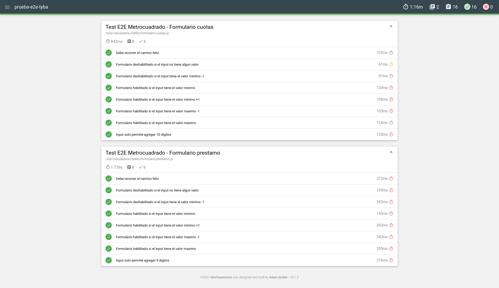

# Pruebas E2E a módulo de calculadora de crédito de Metrocuadrado con Selenium, Mocha y Chai

### Dependencias

- [**chromedriver**](https://chromedriver.chromium.org/) : `ChromeDriver` es un servidor independiente o un ejecutable independiente que `Selenium WebDriver` utiliza para controlar Chrome.

- [**selenium-webdriver**](https://www.selenium.dev/documentation/en/webdriver/) : `Selenium WebDriver` es una colección de APIs de código abierto que se utilizan para automatizar las pruebas de una aplicación web.

- [**mocha**](https://mochajs.org/) : `Mocha` es un framework de pruebas de JavaScript que se ejecuta en Node.js. Nos da la posibilidad de crear tanto tests síncronos como asíncronos de una forma muy sencilla. Nos proporciona muchas utilidades para la ejecución y el reporte de los tests.

- [**chai**](https://www.chaijs.com/) : `Chai` es un librería de aserciones, la cual se puede emparejar con cualquier marco de pruebas de Javascript.

- [**chai-as-promised**](https://www.npmjs.com/package/chai-as-promised) : `Chai` no es muy bueno para solicitudes asincrónicas, por lo que este complemento nos ayudará a usar comandos de aserción en promesas.

### Requerimientos

- [`nodejs version LTS 14`](https://nodejs.org/en/download/)
- `npm version 6.14` (Incluido junto con nodejs)
- [`Google Chrome Version 90`](https://www.google.com/chrome/)
  > En caso de tener una versión de Google Chrome diferente, modificar la versión de la dependencia `chromedriver` dentro del `package.json`.

### Configuración y ejecución

```sh
npm install
npm run test:e2e
```

### Resultados

Luego de correr las pruebas, abrir el archivo `mochawesome-report/mochawesome.html` en el navegador para acceder al reporte.

```
> mocha --timeout 20000 e2e/*/*.js --reporter mochawesome

  Test E2E Metrocuadrado - Formulario cuotas
    ✓ Debe recorrer el camino feliz (114ms)
    ✓ Formulario deshabilitado si el input no tiene algun valor (46ms)
    ✓ Formulario deshabilitado si el input tiene el valor minimo -1 (115ms)
    ✓ Formulario habilitado si el input tiene el valor minimo (100ms)
    ✓ Formulario habilitado si el input tiene el valor minimo +1 (129ms)
    ✓ Formulario habilitado si el input tiene el valor maximo -1 (117ms)
    ✓ Formulario habilitado si el input tiene el valor maximo (123ms)
    ✓ Input solo permite agregar 10 digitos (102ms)

  Test E2E Metrocuadrado - Formulario prestamo
    ✓ Debe recorrer el camino feliz (280ms)
    ✓ Formulario deshabilitado si el input no tiene algun valor (102ms)
    ✓ Formulario deshabilitado si el input tiene el valor minimo -1 (219ms)
    ✓ Formulario habilitado si el input tiene el valor minimo (239ms)
    ✓ Formulario habilitado si el input tiene el valor minimo +1 (90ms)
    ✓ Formulario habilitado si el input tiene el valor maximo -1 (253ms)
    ✓ Formulario habilitado si el input tiene el valor maximo (260ms)
    ✓ Input solo permite agregar 9 digitos (231ms)


  16 passing (1m)
```


